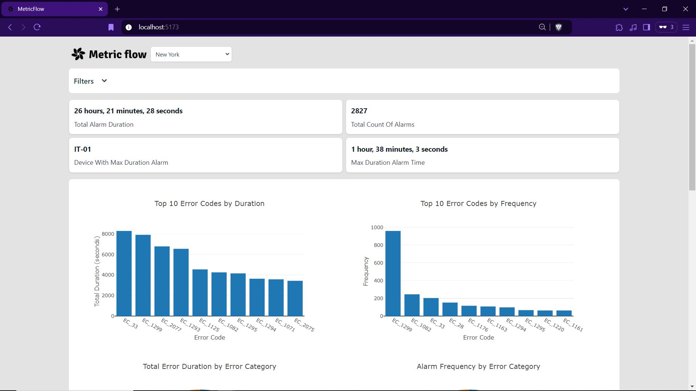
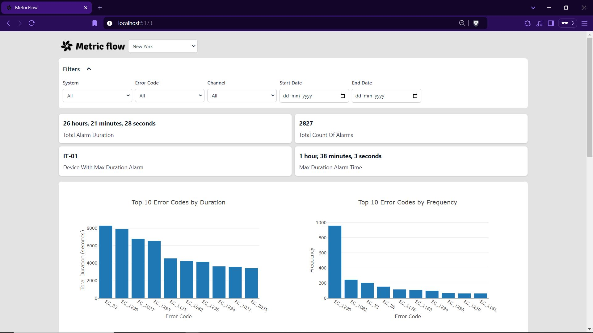
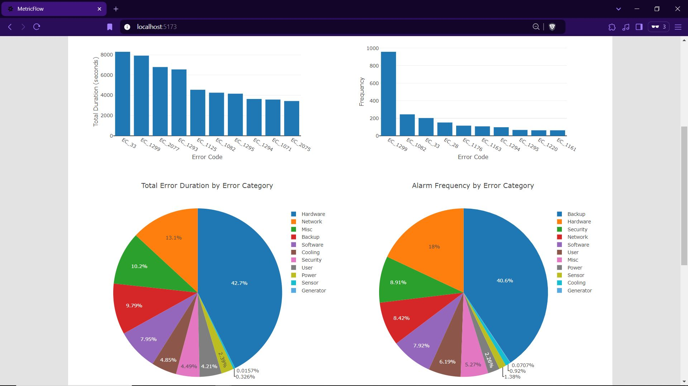
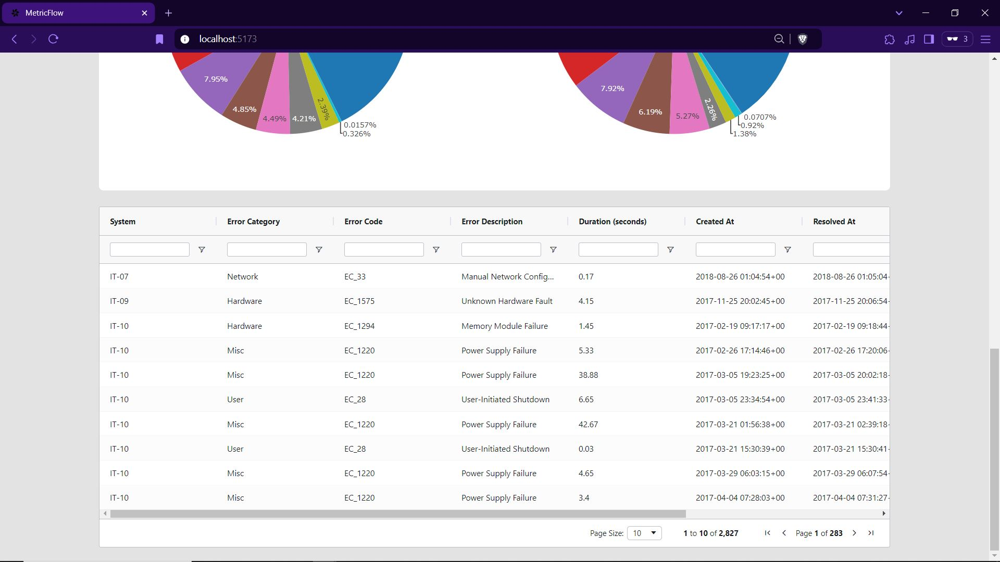

# MetricFlow - IT analytics dashboard-monitoring tool

A React-based client application for visualizing and monitoring faults across IT devices

## Technologies used
- React
- Tailwindcss
- Plotly
- AG Grid

## Features
- Location, Error Code, Date Range filter ..etc
- Top 10 Error Codes by Duration
- Top 10 Error Codes by Frequency
- Tabular view of all error data with sorting, filtering functionality


## Installation:
```
cd client
npm install
```

## Steps to run development environment
```
npm run dev
```

## Frontend url
```
http://localhost:5173/
```

## Dashboard:


### Filters expanded


### Graphs view


### Table view


<video width="320" height="240" controls>
  <source src="./media/metricflow_demo.mp4" type="video/mp4">
</video>